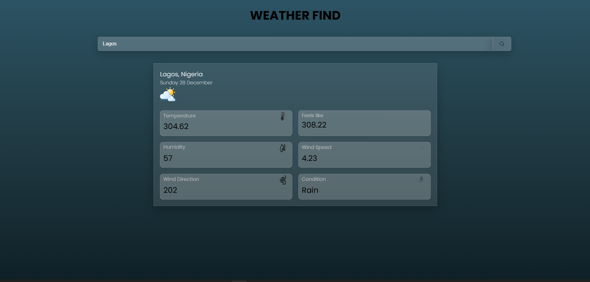

# weather-app-js
# Weather App

A simple weather application built with JavaScript that fetches real-time weather data using a public API.

## Live Demo
https://blackjosh007.github.io/weather-app-js/

## Screenshots

## Features
- Search weather by city
- Displays temperature and weather conditions
- Responsive design

## Technologies Used
- HTML
- CSS
- JavaScript
- Fetch API
